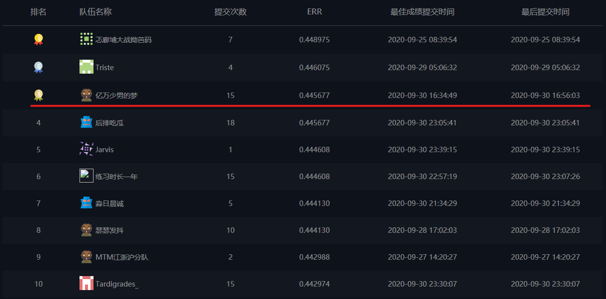

# [DIGIX-RANK-2020](https://developer.huawei.com/consumer/en/activity/devStarAI/algo/competition.html#/preliminary/info/digix-trail-02/introduction)



对于Web数据的搜索引擎，排序是其核心问题。提升排序的准确度能够极大提升用户的搜索体验。在本次大赛中，主办方提供用于排序模型构建的数据，参赛选手基于给定的数据构建排序模型。希望通过本次大赛挖掘搜索引擎排序算法的人才，推动搜索引擎排序算法的发展。

## 1. 赛题说明

排序是信息检索的核心技术：给定一个Query，系统能够基于文档和Query的相关性，将候选的文档做排序，展现给用户。本次比赛提供的数据集包含两部分：训练集和测试集。其中训练集包含相关度标签、queryid、文档id和各类特征数据，选手基于该数据集训练排序模型。测试集包含queryid、文档id和各类特征数据，选手基于测试集提供预测后的相关度得分。

## 2. 数据说明

比赛数据选取了生产系统中若干个query和文档，随机拆分为训练集和测试集。训练集和测试集的文件格式一致，不包含行头，列之间通过'\t'字符分割。

每一行都是一个query-文档对，各列的描述如下:

* 第1列：query和文档的相关度标记值，值越高，代表越相关

* 第2列：query id,数字类型，唯一标识一个query

* 第3列：文档ID, 数字类型，唯一标识一个文档

* 第4到365列：362个特征值，特征描述见赛事简介

数据集中索引地址和特征类别的对应关系如下。数据集中索引位置3到200的字段类型为NUMERICAL，索引位置201到364的字段类型为CATEGORY。

## 3. 模型介绍

* pointwise: LGBMRegressor + XGBRegressor

* listwise: LGBMRanker + XGBRanker

* stacking 融合

* B榜线上结果: 0.445677

## 4. 环境配置

* pip install pandas numpy lightgbm xgboost scikit-learn wget

* Linux Ubuntu 16.04, 160GB内存，4*V100

## 5. 目录结构
```
.
├── data (数据目录)
│   └── download.py
├── src 
│   ├── lgb.py (lgb回归模型)
│   ├── lgbranker.py (listwise模型)
│   ├── preprocess.py (数据预处理)
│   ├── stacking.py (模型融合)
│   ├── utils.py (工具类/方法)
│   ├── xgb.py (xgb回归模型)
│   └── xgbranker.py (listwise模型)
├── picture
├── run.sh (执行脚本)
└── README.md
```

## 6. 运行
```
bash run.sh
```

## 7. 参考资料

[机器学习算法-初识Learning to Rank]('https://jiayi797.github.io/2017/08/30/%E6%9C%BA%E5%99%A8%E5%AD%A6%E4%B9%A0%E7%AE%97%E6%B3%95-%E5%88%9D%E8%AF%86Learning-to-Rank/')

[深入浅出排序学习：写给程序员的算法系统开发实践]('https://tech.meituan.com/2018/12/20/head-in-l2r.html')

[Learn To Rank 简介]('https://www.cnblogs.com/bentuwuying/p/6681943.html')

[Learning to Rank算法介绍：RankNet，LambdaRank，LambdaMart]('https://www.cnblogs.com/bentuwuying/p/6690836.html')

[搜索排序算法]('https://octopuscoder.github.io/2020/01/19/%E6%90%9C%E7%B4%A2%E6%8E%92%E5%BA%8F%E7%AE%97%E6%B3%95/')

[Learning-to-rank with LightGBM (Code example in python)]('https://medium.com/@tacucumides/learning-to-rank-with-lightgbm-code-example-in-python-843bd7b44574#id_token=eyJhbGciOiJSUzI1NiIsImtpZCI6IjJjNmZhNmY1OTUwYTdjZTQ2NWZjZjI0N2FhMGIwOTQ4MjhhYzk1MmMiLCJ0eXAiOiJKV1QifQ.eyJpc3MiOiJodHRwczovL2FjY291bnRzLmdvb2dsZS5jb20iLCJuYmYiOjE2MDEwMzg2NzIsImF1ZCI6IjIxNjI5NjAzNTgzNC1rMWs2cWUwNjBzMnRwMmEyamFtNGxqZGNtczAwc3R0Zy5hcHBzLmdvb2dsZXVzZXJjb250ZW50LmNvbSIsInN1YiI6IjExNDg1Nzg5ODIzMDM1NDA3MDA2OSIsImVtYWlsIjoibmp1LmxpdWppOTdAZ21haWwuY29tIiwiZW1haWxfdmVyaWZpZWQiOnRydWUsImF6cCI6IjIxNjI5NjAzNTgzNC1rMWs2cWUwNjBzMnRwMmEyamFtNGxqZGNtczAwc3R0Zy5hcHBzLmdvb2dsZXVzZXJjb250ZW50LmNvbSIsIm5hbWUiOiJKaSBMaXUiLCJwaWN0dXJlIjoiaHR0cHM6Ly9saDMuZ29vZ2xldXNlcmNvbnRlbnQuY29tL2EtL0FPaDE0R2dYUjFtXzBWOXpvTUJubWJHSjhaWTMtSkRBVkpKN2hNX3pPbURiPXM5Ni1jIiwiZ2l2ZW5fbmFtZSI6IkppIiwiZmFtaWx5X25hbWUiOiJMaXUiLCJpYXQiOjE2MDEwMzg5NzIsImV4cCI6MTYwMTA0MjU3MiwianRpIjoiNzcyMjI1OTM3ZDljNjFkMzhmZDk5NmYyZDIwYjA0OGQxNjY3NDNiZiJ9.JFZvIZ9XcCLSf1_35-QyLm57pGaKbNWk59YXboW7Cj3Bqsqx_a3glTwyyAVHTDeTpOzsm4Z85G0L4aULxypA9L9XT2VfnLRrJnzOpxVslPoSO5StN1WPEz_ytfhBSU0zqbnMiG7Xrbjq7k-PjksIacKQZtIjA2JC2olPTx9lRNAJfrkuzelipdHXyyBy20jWONWAZjX0D-dI1TZwPl9ZFX-S6fpmVnDa-etC-WWc3Mg5zjVQcUoRNYezRB_t5ZJwDtl02c1ymhyc8RPQ5JKsr_R6A-OXBLWdR9pwv4fCglU3mCeWauGtsRQwiantQ_CMHSPTcjccwZItKKNyGY5ylw')

[Learning to Rank Explained (with Code)]('https://mlexplained.com/2019/05/27/learning-to-rank-explained-with-code/')

[Introduction to Learning to Rank]('https://everdark.github.io/k9/notebooks/ml/learning_to_rank/learning_to_rank.html')

[lightGBM]('https://lightgbm.readthedocs.io/en/latest/pythonapi/lightgbm.LGBMRanker.html')